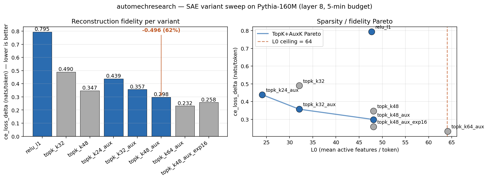

# automechresearch

> Autonomous overnight research loop for **mechanistic interpretability**, inspired by [karpathy/autoresearch](https://github.com/karpathy/autoresearch).

*Karpathy's autoresearch lets an AI agent iterate on nanochat pretraining overnight. `automechresearch` does the same thing for mech-interp: a Claude / Codex / whatever agent iterates on a **sparse autoencoder** trained on Pythia-160M, scoring itself on a single hard metric. You wake up to ~80 experiments, a human-readable journal, and a branch pointing at an SAE measurably better than the baseline.*



*Demo sweep (`bench/compare.py`): eight SAE configurations, five minutes of training each. Blue = valid (passes all constraints); grey = invalid. Left panel: `ce_loss_delta` per variant (lower = better). Right panel: the sparsity/fidelity Pareto traced by TopK+AuxK as K varies from 24 to 48. Findings from this mini-sweep:*

*1. **AuxK is load-bearing.** Naive TopK crushes the L1 baseline on reconstruction but kills 45–60% of features; Gao+2024's AuxK loss resurrects them (`topk_k48_aux` ends at 0.9% dead).*

*2. **Best valid variant: `topk_k48_aux` at 0.298 nats/token — a 62% cut over the ReLU+L1 baseline.***

*3. **Two lower-right points are tantalizingly invalid.** `topk_k64_aux` hits 0.232 (best of all) but measures L0=64.1 — fails the ≤64 ceiling by a rounding error. `topk_k48_aux_exp16` (double the dictionary) hits 0.258 but the five-minute budget isn't enough time to resurrect enough of the 12k features: dead fraction was still trending down (4780 → 136) when the timer ran out. Both are real research leads, not free lunches — the first wants either K=63 or a measurement-robustness fix; the second wants more compute or a lower dead-threshold.*

*This is ~8 autonomous-loop iterations; the overnight agent runs ~80.*

## The big idea: `val_bpb` for SAEs

The autoresearch pattern only works if every experiment produces **one scalar metric, comparable across architectures**. The SAE analog:

- **Primary metric: `ce_loss_delta`** — extra cross-entropy (nats per token) the base model incurs on a held-out eval set when the residual stream at layer 8 is replaced by the SAE's reconstruction. Lower = better.
- **Hard constraints** (violation ⇒ `invalid`):
  - `l0 ≤ 64` — no cheating by becoming dense
  - `dead_fraction ≤ 0.10` — no cheating by hiding features
  - `peak_vram_gb ≤ 14` — portability guardrail (any 16 GB GPU should run this)
  - Run completes within the 5-minute training budget

Everything else — architecture, optimizer, loss, dict size, initialization — is the agent's to tune.

## Layout

```
prepare.py                 # constants, model, data, activation cache, EVAL HARNESS (do not modify)
train_sae.py               # SAE architecture + training loop (agent modifies this)
program.md                 # agent instructions (human modifies this)
reading.md                 # curated SAE literature the agent cites
templates/                 # header/stub formats the agent copies at setup
  results.tsv.header
  hypotheses.template.md
  journal.template.md
pyproject.toml
```

At agent runtime, these three files live at repo root, **untracked** (gitignored), so `git reset --hard` after a discarded run never wipes them:

```
results.tsv                # one row per experiment
hypotheses.md              # written before each run
journal.md                 # written after each run
run.log                    # most recent experiment's stdout
```

## Requirements

- **NVIDIA GPU with ≥16 GB VRAM** (tested on an RTX 4070 Ti Super, 16 GB).
- Python 3.10+, [uv](https://docs.astral.sh/uv/).
- ~10 GB free disk for the activation cache (4M train + 500K eval tokens at fp16).

Other platforms (CPU, MPS, AMD) are not supported in the main branch to keep the code minimal. Forks welcome — see `prepare.py` constants for the knobs you'd tune.

## Quickstart

```bash
# 1. Install uv
curl -LsSf https://astral.sh/uv/install.sh | sh

# 2. Install dependencies
uv sync

# 3. One-time data prep: tokens + activation cache (~5 min, ~7 GB on disk)
uv run prepare.py

# 4. Sanity-check a single training run (~6 min)
uv run train_sae.py
```

If both commands work, you are ready for autonomous mode.

## Running the agent

Spin up Claude Code / Codex / whatever in this directory and prompt:

```
Have a look at program.md and let's kick off a new experiment. Start with setup.
```

The agent reads `program.md`, creates a branch `autosae/<tag>`, copies the templates, and begins the experiment loop. Leave it overnight. In the morning: `results.tsv`, `journal.md`, and `hypotheses.md` are your morning reading.

## Visualizations

Before letting an agent loose, it helps to understand the base model. The
optional `viz` layer generates self-contained HTML dashboards:

```bash
# One-shot tour of the frozen Pythia-160M: induction heads, attention patterns,
# logit lens, and per-layer residual stream norms. ~10 seconds.
uv run python -m viz.tour
# -> writes tour.html (gitignored). Open in any browser.
```

What the tour covers:

- **Induction-head scores** — prefix-matching score per (layer, head) on
  repeated random sequences (Olsson+2022). Useful sanity check that the base
  model has the circuits SAEs typically find.
- **Attention pattern viewer** — dropdown through all 12×12 heads on a short
  name-tracking prompt.
- **Logit lens** — projects each layer's residual stream through the
  unembedding, so you can watch predictions sharpen across depth
  (nostalgebraist 2020).
- **Residual stream norms** — layer-wise ‖h‖ on real sentences. Shows why
  layer 8 (our SAE target) has the scale it does.

Planned: `viz/dashboard.py` (auto-generated after each `train_sae.py` run),
`viz/explore_features.py` (feature browser for a trained SAE).

For the static README chart above, a separate scripted sweep lives in `bench/`:

```bash
uv run python -m bench.compare     # runs all variants, writes bench/benchmark.tsv
uv run python -m bench.plot        # re-renders bench/compare.png from the tsv
```

`bench/` is intentionally distinct from `train_sae.py` — it lets us diff
several architectures in one invocation for the README, without touching
the single file the agent is supposed to edit.

## Design choices

- **Single file to modify.** The agent only touches `train_sae.py`. Small diffs, small blast radius.
- **Fixed time budget.** Training is always 5 minutes, regardless of machine. Runs are directly comparable. On a 4070 Ti Super you get ~8–10 experiments per hour.
- **One scalar metric.** `ce_loss_delta` is architecture- and vocab-independent, so a TopK SAE with 6k features and a JumpReLU SAE with 12k features are scored on the same ruler.
- **Hypothesis-first + journal logging.** Intentional departure from Karpathy's minimalism: the agent writes a hypothesis *before* and a paragraph writeup *after* each run. This is what makes the overnight run a learning tool rather than a black box.
- **Reading list.** `reading.md` anchors the agent in the real SAE literature. Each hypothesis must cite a paper (short tag). The journal becomes a guided tour of modern SAE research.
- **Self-contained.** Just PyTorch + Transformers + Datasets. No Flash Attention kernels, no torch.compile, no distributed training.

## Portability to ≥16 GB GPUs

The default settings (Pythia-160M at layer 8, expansion 8, batch 4096) peak around 7 GB on a 4070 Ti Super. On a 16 GB card you have plenty of headroom for the agent to try expansion=32, larger batch sizes, or ghost-grad auxiliary passes. If you want more room on a smaller card, knobs live in `prepare.py`:

- `MODEL_NAME` → `EleutherAI/pythia-70m-deduped` (d_model=512)
- `LAYER` → a shallower layer
- `MAX_SEQ_LEN` → 256
- `TRAIN_TOKENS` / `EVAL_TOKENS` → smaller
- `L0_TARGET` → scales with d_model, so halve it if you halved d_model

## License

MIT.
